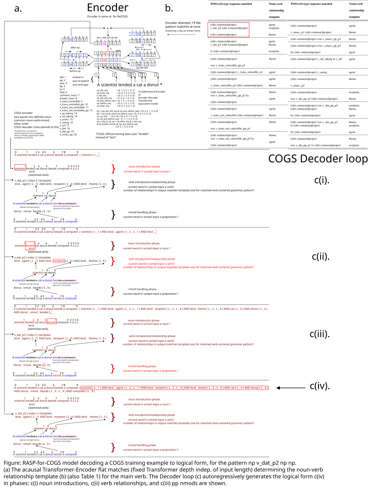
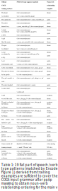

# RASP-for-COGS

To support Kim and Linzen 2020's original COGS format ( https://aclanthology.org/2020.emnlp-main.731/ ) (vs the simplified and semantically equivalent ReCOGS from (Wu et al 2023; https://doi.org/10.1162/tacl_a_00623 ), which we built a model for earlier in RASP described at https://github.com/willy-b/RASP-for-ReCOGS ).

To try this out, run `python cogs_examples_in_rasp.py`!

`cogs_examples_in_rasp.py` can be used to evaluate on training data (default, use `--num_train_examples_to_check` to adjust the number of examples evaluated) 

or dev set data (`--use_dev_split`), 

or run a real test/gen evaluation (`--use_test_split`, `--use_gen_split`).

Context:
It is simpler and runs faster to just train a Transformer on examples!

This is an academic exercise, writing a neural network compatible program by hand in the Restricted Access Sequence Processing (compilable to Transformer) language (Weiss et al 2021, https://proceedings.mlr.press/v139/weiss21a.html ) to prove a Transformer can perform a particular type of solution (building a systematic and compositional solution without a tree-structured/hierarchical representation (flat attention-head based pattern matching) that can handle recursive grammar by unrolling it in the decoder loop).

**We want to show how a Transformer using rules derived from COGS official training examples (see Table 1 below in RASP-for-COGS Encoder-Decoder Schematic section) can solve the structural generalization splits of the "COGS: A Compositional Generalization Challenge Based on Semantic Interpretation" (Kim and Linzen 2020, https://aclanthology.org/2020.emnlp-main.731 ) task in the original COGS format** - **Transformers trained from scratch on the training split have been reported in the literature to do as poorly as 0% accuracy on the structural generalizations by multiple authors (see background / literature review section below).**

**What does this have to do with generalization instead of just solving the generalization splits?**

For one, the flat pattern matching approach consistent with training examples (does not require exposure to greater depth examples) avoids an assumed cause of failure to structurally generalize / length generalize, as by showing extracting the logical form does NOT require constructing a hierarchical parse of the sentence, we avoid what one might call “Csordás’ curse” (Csordás et al., 2022; https://openreview.net/forum?id=KBQP4A_J1K ), that "[for compositional operations] the network should be sufficiently deep, at least as deep as the deepest data dependency in the computational graph built from elementary operations (e.g., in the case of a parse tree, this is the depth of the tree)", and all those depths need to be trained. Though (Csordás et al., 2022; https://openreview.net/forum?id=KBQP4A_J1K ) (and also Universal Transformers (Dehghani et al., 2019; https://openreview.net/forum?id=HyzdRiR9Y7 )) suggest reusing the same weights for each layer to avoid this (and other “tree-structured” architectures (e.g. the Tree-LSTM in (Liu et al., 2021; https://doi.org/10.18653/v1/2021.findings-acl.97 )) force depth symmetry in other ways, like using the same fixed depth neural network to combine pairs of sequence positions in a tree structured way), in a vanilla Transformer, Csordás’ curse also implies the same compositional operations would need to be relearned by the weights at each layer depth independently, providing one clear mechanism for a failure to generalize to new sequence lengths if the new lengths came from unseen parse tree depths (e.g. as in the COGS/ReCOGS prepositional phrase recursion generalization splits, where training on depths 0-2 is then tested on depths up to recursion depth 12 (Kim and Linzen 2020, https://aclanthology.org/2020.emnlp-main.731 )). That is, by Csordás’ curse, any solution involving a hierarchical parse in a vanilla Transformer learned at shallower recursion depths in training data will NOT be able to generalize to deeper recursion depths whereas our flat pattern matching with masking approach can. **(None of this is an argument against the "deep" in "deep learning" but rather that if the layer depth requirement scales arbitrarily with complexity of the input instead of breaking it up into chunks which can be handled with some fixed depth (which could be many layers deep but not increasing arbitrarily with input complexity), then in the case of required layer depth scaling arbitrarily with input complexity one should expect generalization issues as more complex inputs as inference time would activate depths not trained during training.)**

See also our finished RASP solution to the semantically equivalent ReCOGS task (Wu et al 2023, "ReCOGS: How Incidental Details of a Logical Form Overshadow an Evaluation of Semantic Interpretation", https://doi.org/10.1162/tacl_a_00623 ) in the code associated with that paper at https://arxiv.org/abs/2504.15349 (latest revised and improved version based on conference reviewer feedback: https://raw.githubusercontent.com/willy-b/RASP-for-ReCOGS/fd2e162a9bf7e1830bb7da17f170ca0f13cba2de/rasp-for-recogs_pos-2024-draft.pdf ).

(Note: We referenced the convenient summary of Kim, Linzen's COGS task grammar and vocab made by IBM's CPG project (their utilities, not their CPG project itself) at https://github.com/IBM/cpg/blob/c3626b4e03bfc681be2c2a5b23da0b48abe6f570/src/model/cogs_data.py#L523 during development, restricting ourselves to the vocabulary available in the training data.)

Note this work is focused on structural generalization, not lexical generalization.

## More background / literature review

(Note: You can skip to results and visual explainers of how the model works in the next sections, but potentially useful background and references are provided here.)

(Kim and Linzen, 2020; https://aclanthology.org/2020.emnlp-main.731 ) introduce the COmpositional Generalization Challenge based on Semantic Interpretation (COGS) benchmark, arguing that Transformers have low accuracy on the generalization splits (35% overall), especially structural generalization splits where near 0% accuracy is reported, using a 2-layer Encoder-Decoder Transformer (2 layers for Encoder, 2 layers for Decoder), and speculate that a hierarchical/tree-structured inductive bias is likely to be required to overcome the difficulty in structural generalization. (Murty et al., 2023b; https://openreview.net/forum?id=sAOOeI878Ns ) study how Transformers learn to solve COGS and other compositional datasets and measure the tree-structuredness of the representations and argue it predicts which training checkpoints exhibit better compositional generalization. (Yao and Koller, 2022; https://doi.org/10.18653/v1/2022.emnlp-main.337 ) survey seq2seq models broadly (both LSTMs and Transformers) and find they all struggle on COGS structural generalizations and give two examples of explicitly tree-structured models (forcing tree-structured representations) as an alternative that do very well (Liu et al., 2021; https://doi.org/10.18653/v1/2021.findings-acl.97 ) and (Weißenhorn et al., 2022; https://doi.org/10.18653/v1/2022.starsem-1.4 ). Finally, (Lake and Baroni, 2023; https://www.nature.com/articles/s41586-023-06668-3 ) use a "meta-learning for compositionality" approach with a 3-layer Encoder-Decoder Transformer architecture and achieve what they call "human-like systematic generalization", achieving high scores on everything in the COGS benchmark (>99% on lexical generalizations) EXCEPT the structural generalization splits where they also still score 0% accuracy. However, one notices these networks are shallow compared with those used in successful large-pretrained Transformer models (e.g. 24-layer BERT where compositional parse trees seem to be encoded in its vector space representation (Hewitt and Manning, 2019; https://aclanthology.org/N19-1419/ )), and it is claimed, by e.g. (Csordás et al., 2022; https://openreview.net/forum?id=KBQP4A_J1K ) that for compositional operations, like parsing, the depth of the network must be at least the maximum number of compositional operations, e.g. the height of the parse tree. Remarkably, (Petty et al., 2024; https://doi.org/10.18653/v1/2024.naacl-long.402 ) finds that increasing the layer depth of the Transformer models (up to 32 layers) does not improve the near 0% accuracy on COGS structural generalization splits like prepositional phrase modification of subject when the network has only seen it on the object during training and also input length/depth generalizations (like pp/cp recursion).

We use (Weiss et al., 2021; https://proceedings.mlr.press/v139/weiss21a.html )’s Restricted Access Sequence Processing (RASP) language that can be compiled to concrete Transformer weights to prove by construction that a Transformer encoder-decoder using rules that can be clearly derived from specific official COGS training examples (see Table 1) can perform COGS over the vocabulary and grammar of that task in a systematic, compositional way including the difficult structural generalizations as a rigorous starting point to investigating when Transformers might learn or not actually learn such compositional/systematic solutions. Contrary to the speculation of the COGS authors (Kim and Linzen, 2020; https://aclanthology.org/2020.emnlp-main.731 ) and (Murty et al., 2023b; https://openreview.net/forum?id=sAOOeI878Ns ) we find a flat, not hierarchical/tree-structured approach is feasible for COGS including structural generalization provided the model learns to mask out prepositional phrase nouns when extracting noun verb relationships (pp masking). (That is, the RASP-for-COGS model does not apply recursive, tree-structured rules like `np_det pp np -> np_pp -> np`, but still scores >98% string exact match on pp recursion, cp recursion using the decoder loop, and 100% on the very difficult obj-pp-to-subj-pp split; confidence intervals in results below.) PP noun masking is an alternate approach to recursively combining prepositional modifications (`np_det pp np -> np_pp -> np`) for handling center-embedded prepositional modifications (which occur in training, e.g. "Isabella forwarded a box _on a tree_ to Emma") that also generalizes AND has attractive computational properties (does not require increasing layer depth to handle deeper pp recursion, which is also better for generalization as a solution where the layer depth activated depends on the grammar recursion depth / parse tree height cannot generalize to deeper depths at inference than seen in training as deeper layers would be used at inference than trained in training; the same problem also motivates alternate solutions using weight sharing and tree-structured networks). In our earlier work (Bruns 2025; https://arxiv.org/abs/2504.15349 ) we analyzed the errors (Wu et al 2023; https://doi.org/10.1162/tacl_a_00623 )'s trained from scratch baseline Transformer made on the ReCOGS_pos version of the COGS obj-pp-to-subj-pp generalization split and found that its behavior was consistent with a flat/non-tree structured approach but without having learned prepositional phrase noun masking leading to consistent attraction-to-the-nearest-noun errors in noun-verb relationship extraction which would otherwise not be expected.

## Results

**Test set results:** `99.97% or 2999 out of 3000 string exact match (95% confidence interval: 99.81% to 100.00%)` 

Note: The RASP-for-COGS confidence intervals are Clopper-Pearson confidence intervals ( https://en.wikipedia.org/w/index.php?title=Binomial_proportion_confidence_interval&oldid=1252517214#Clopper%E2%80%93Pearson_interval ) which handle well the confidence intervals expected for the performance of a deterministic program to be evaluated on future samples from the same distribution even if no errors were observed yet (in which case the confidence interval just depends on the number of samples; bootstrapping would not have any uncertainty if no errors were observed yet). The upper bound here is less than 100% but greater than or equal to 99.995%, as 1 missed in 3000 could be consistent with an error rate less than or equal to 1 in 20,000 (99.995% exact match accuracy or better) within 95% confidence.

**Generalization split results** (results are in for all splits except cp_recursion, which is still evaluating).

The focus of this work is on structural generalizations, especially those involving the recursive, potentially center-embedding prepositional phrases.

We find that **the main structural generalization split of interest** (was a focus of the separate RASP-for-ReCOGS paper in the ReCOGS variant of COGS), **obj_pp_to_subj_pp , had 100% string exact match performance**:
```
obj_pp_to_subj_pp: 100.00% (95.00% confidence interval: 99.63% to 100.00% (1000.0 out of 1000))
```

The other main structural generalization split, **prepositional phrase recursion also had strong performance (98.40% string exact match), despite RASP-for-COGS lacking any support for recursive rules or hierarchical representation** (just unrolling recursion in the decoder loop):
```
pp_recursion: 98.40% (95.00% confidence interval: 97.41% to 99.08% (984.0 out of 1000))
```

The other complete generalization splits for non-recursive parts of the COGS grammar are given below:
```
Exact match score on first 19000 of COGS gen:

99.96% or 18993.0 out of 19000 (95% confidence interval: 99.92% to 99.99%)

Exact Match % by category:
active_to_passive: 100.00% (95.00% confidence interval: 99.63% to 100.00% (1000.0 out of 1000))
do_dative_to_pp_dative: 99.90% (95.00% confidence interval: 99.44% to 100.00% (999.0 out of 1000))
obj_omitted_transitive_to_transitive: 100.00% (95.00% confidence interval: 99.63% to 100.00% (1000.0 out of 1000))
obj_pp_to_subj_pp: 100.00% (95.00% confidence interval: 99.63% to 100.00% (1000.0 out of 1000))
obj_to_subj_common: 100.00% (95.00% confidence interval: 99.63% to 100.00% (1000.0 out of 1000))
obj_to_subj_proper: 99.90% (95.00% confidence interval: 99.44% to 100.00% (999.0 out of 1000))
only_seen_as_transitive_subj_as_unacc_subj: 100.00% (95.00% confidence interval: 99.63% to 100.00% (1000.0 out of 1000))
only_seen_as_unacc_subj_as_obj_omitted_transitive_subj: 100.00% (95.00% confidence interval: 99.63% to 100.00% (1000.0 out of 1000))
only_seen_as_unacc_subj_as_unerg_subj: 100.00% (95.00% confidence interval: 99.63% to 100.00% (1000.0 out of 1000))
passive_to_active: 100.00% (95.00% confidence interval: 99.63% to 100.00% (1000.0 out of 1000))
pp_dative_to_do_dative: 99.90% (95.00% confidence interval: 99.44% to 100.00% (999.0 out of 1000))
prim_to_inf_arg: 100.00% (95.00% confidence interval: 99.63% to 100.00% (1000.0 out of 1000))
prim_to_obj_common: 99.80% (95.00% confidence interval: 99.28% to 99.98% (998.0 out of 1000))
prim_to_obj_proper: 100.00% (95.00% confidence interval: 99.63% to 100.00% (1000.0 out of 1000))
prim_to_subj_common: 100.00% (95.00% confidence interval: 99.63% to 100.00% (1000.0 out of 1000))
prim_to_subj_proper: 100.00% (95.00% confidence interval: 99.63% to 100.00% (1000.0 out of 1000))
subj_to_obj_common: 99.80% (95.00% confidence interval: 99.28% to 99.98% (998.0 out of 1000))
subj_to_obj_proper: 100.00% (95.00% confidence interval: 99.63% to 100.00% (1000.0 out of 1000))
unacc_to_transitive: 100.00% (95.00% confidence interval: 99.63% to 100.00% (1000.0 out of 1000))

[skip multiple blank lines]

Exact Match score on first 19000 of COGS gen:

99.96315789473684% or 18993.0 out of 19000 (95% confidence interval: 99.92% to 99.99%)
```

Lastly, the third and final structural generalization split, the sentential complement recursion (cp_recursion) split, alone is still being evaluated, but also has strong performance so far.
Here are the scores on the trials completed so far, out of what will be n=1000 total for the split:
```
Exact Match % by category (so far):
cp_recursion: 99.85% (95.00% confidence interval: 99.15% to 100.00% (651.0 out of 652))
```

## RASP-for-COGS Encoder-Decoder Schematic (simplified)



And Table 1 showing the 19 grammar patterns used above for noun-verb relationship ordering templates associated with specific official COGS training examples (of many examples of each in the training set), as well as the first center embedded prepositional phrase official COGS training example that motivates pp masking (of many):



Note the number, 19, of the grammar patterns coincidentally matches the number of non-recursive generalization splits but that is a coincidence and these are not derived from generalization set data (see examples in the Table).

Any non-standard sentences mentioned in our RASP model code (only to demonstrate, not functionally important) are shown below to be equivalent to official COGS (also in ReCOGS) training examples:


## Intended use and warnings

These are intended be obvious or self-evident conditions, but especially for those who do not read the motivating RASP-for-ReCOGS paper ( https://arxiv.org/abs/2504.15349 ):

The RASP-for-COGS model applied to unintended use WILL give invalid results or halt - **we have NOT provided a general language model**, we have provided a simulation of how a Transformer could perform a specific task.
The RASP-for-COGS model/simulation as provided is **for research purposes only** to prove feasibility of the COGS task by Transformers (especially using a non-tree structured, non-hierarchical flat pattern matching and masking approach, unrolling recursion in the decoder loop) and is not appropriate for ANY other uses whatsoever without modification. For one, an actual Transformer performing the equivalent operations would run orders of magnitude faster, which should be reason enough to not want to use the RASP simulation for actual input-output tasks outside of a research setting. Fallback paths for out-of-grammar examples are also not provided or added by default so the RASP model may halt on natural inputs and will fail to perform semantic parsing on natural language text (would need to be modified simulating training on additional text). It can only run on the in-distribution (non-augmented) training data, and the dev, test, and gen sets (or any reasonable expected generalizations of the training data, not necessarily gen set provided) of COGS, though such aspects could be added. We provide the code for reproducing the results of this study and for researchers who are capable of writing RASP themselves to build upon the work and/or more easily apply RASP to their own problems given our examples, not for immediate application to any other tasks without appropriate modification.
